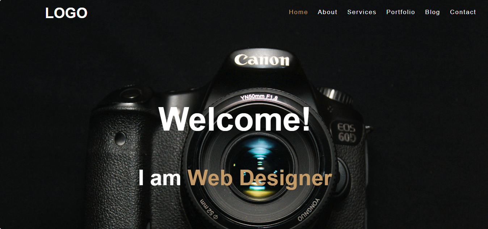
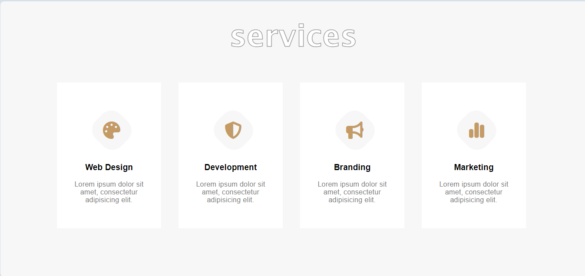
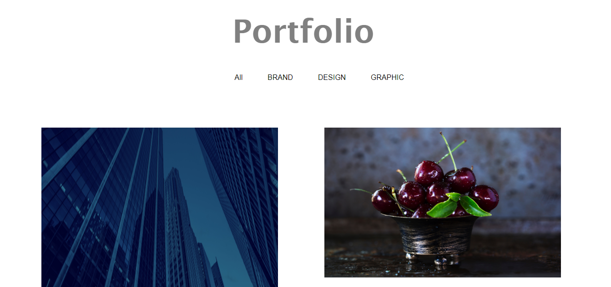
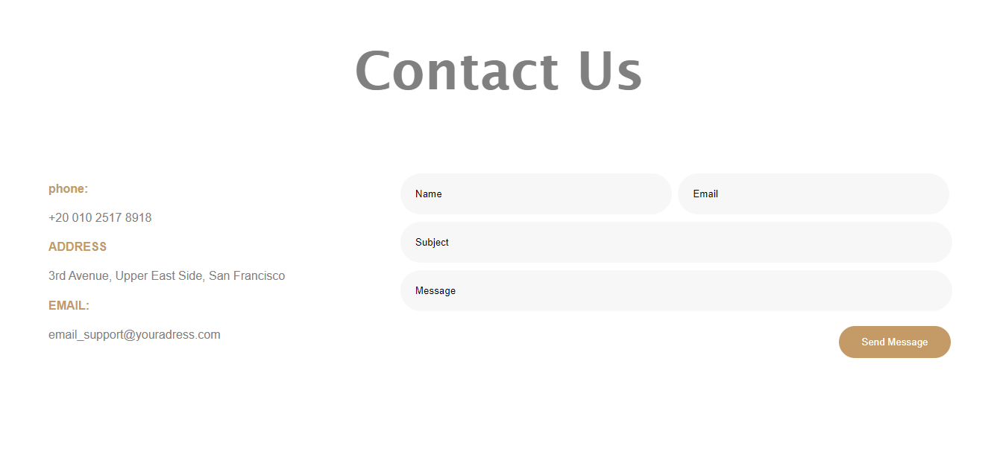

# FrontEnd HTML CSS Landing Page

## Overview
Welcome to the **FrontEnd HTML CSS Landing Page** repository! This project is a simple yet responsive landing page built using **HTML** and **CSS**. It demonstrates modern web design principles, including a clean, user-friendly layout and mobile responsiveness. This landing page is perfect for anyone looking to build a portfolio, business site, or personal brand.

## Features
- Fully responsive layout optimized for mobile and desktop devices.
- Simple and clean design with smooth animations and hover effects.
- Easy to customize for various purposes, including businesses or personal projects.
- Built with HTML5 and CSS3, focusing on semantic markup and modern CSS features.
- Cross-browser compatibility.

## Preview
Here’s a preview of how the landing page looks:








## Getting Started

To view or contribute to this project, follow these steps:

### Clone the Repository
To clone this repository, use the following Git command:
```bash
git clone https://github.com/sajida-dev/FrontEnd-HTML-CSS-Landing-Page.git
